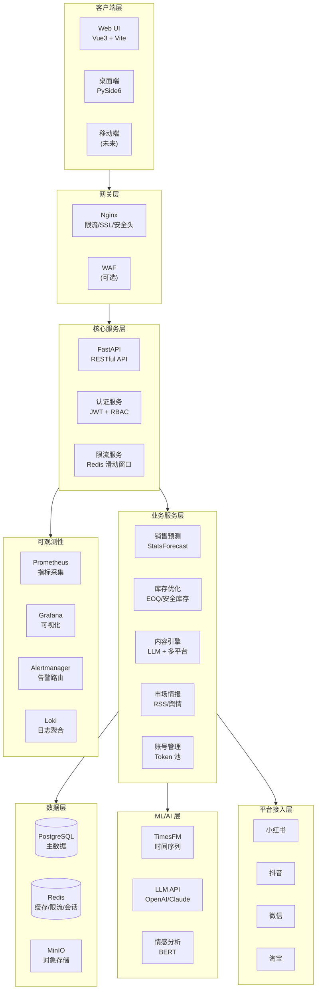
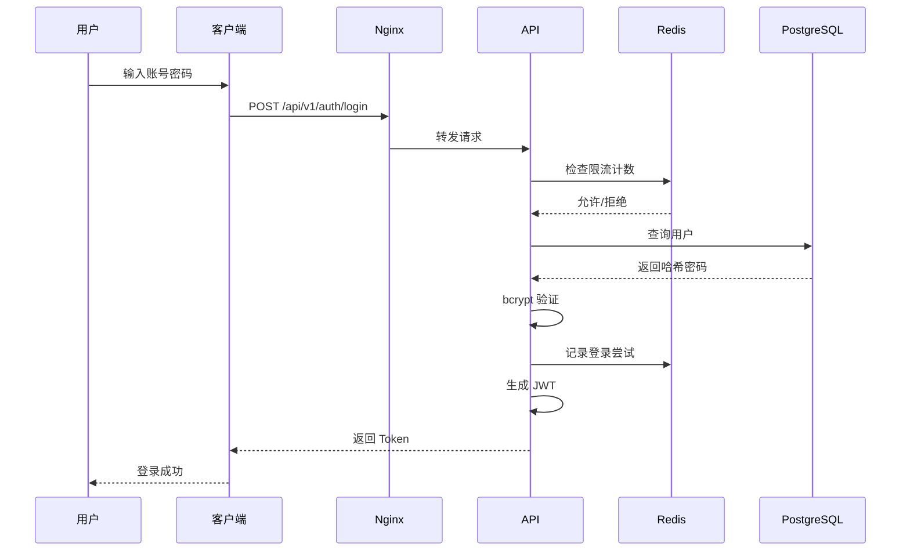
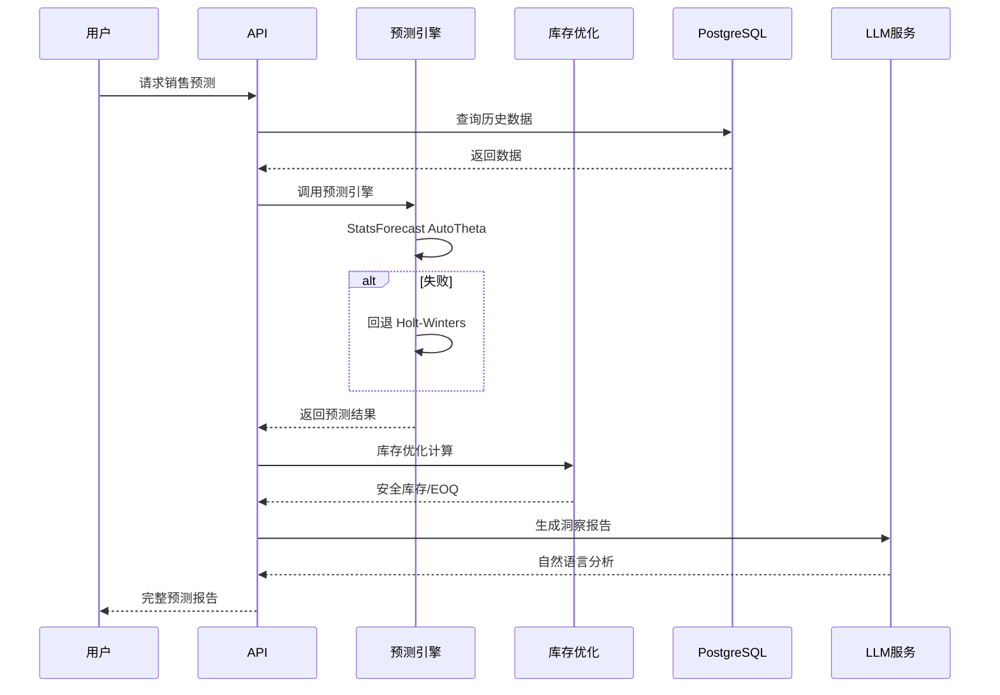
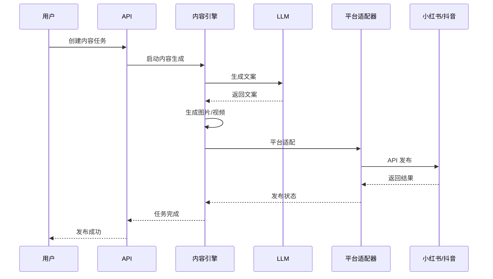
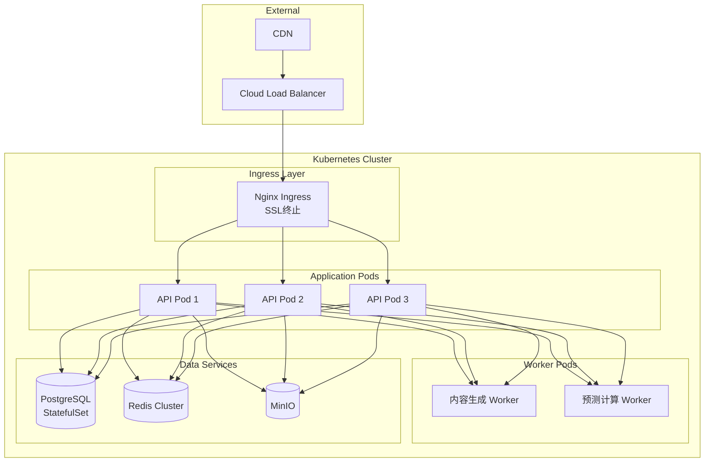
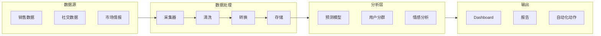
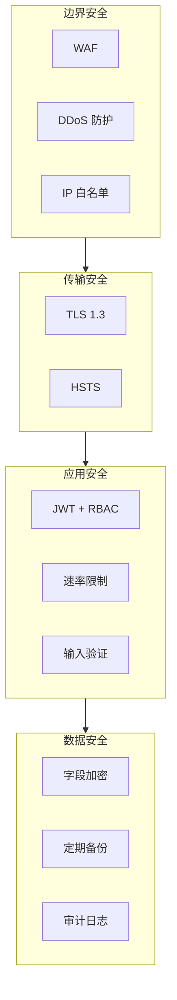

# ACAS Pro - 系统架构

## 整体架构

```mermaid
flowchart TB
    subgraph Client["客户端层"]
        Web["Web UI\nVue3 + Vite"]
        Desktop["桌面端\nPySide6"]
        Mobile["移动端\n(未来)"]
    end

    subgraph Gateway["网关层"]
        Nginx["Nginx\n限流/SSL/安全头"]
        WAF["WAF\n(可选)"]
    end

    subgraph Core["核心服务层"]
        API["FastAPI\nRESTful API"]
        Auth["认证服务\nJWT + RBAC"]
        RateLimit["限流服务\nRedis 滑动窗口"]
    end

    subgraph Business["业务服务层"]
        Forecast["销售预测\nStatsForecast"]
        Inventory["库存优化\nEOQ/安全库存"]
        Content["内容引擎\nLLM + 多平台"]
        Market["市场情报\nRSS/舆情"]
        Account["账号管理\nToken 池"]
    end

    subgraph Data["数据层"]
        PG[("PostgreSQL\n主数据")]
        Redis[("Redis\n缓存/限流/会话")]
        MinIO["MinIO\n对象存储"]
    end

    subgraph ML["ML/AI 层"]
        TimesFM["TimesFM\n时间序列"]
        LLM["LLM API\nOpenAI/Claude"]
        Sentiment["情感分析\nBERT"]
    end

    subgraph Platform["平台接入层"]
        Xiaohongshu["小红书"]
        Douyin["抖音"]
        Wechat["微信"]
        Taobao["淘宝"]
    end

    subgraph Observability["可观测性"]
        Prometheus["Prometheus\n指标采集"]
        Grafana["Grafana\n可视化"]
        Alertmanager["Alertmanager\n告警路由"]
        Loki["Loki\n日志聚合"]
    end

    Client --> Gateway
    Gateway --> Core
    Core --> Business
    Business --> Data
    Business --> ML
    Business --> Platform
    Core --> Observability
```

## 认证流程

```mermaid
sequenceDiagram
    participant U as 用户
    participant C as 客户端
    participant N as Nginx
    participant A as API
    participant R as Redis
    participant DB as PostgreSQL

    U->>C: 输入账号密码
    C->>N: POST /api/v1/auth/login
    N->>A: 转发请求
    A->>R: 检查限流计数
    R-->>A: 允许/拒绝
    A->>DB: 查询用户
    DB-->>A: 返回哈希密码
    A->>A: bcrypt 验证
    A->>R: 记录登录尝试
    A->>A: 生成 JWT
    A-->>C: 返回 Token
    C-->>U: 登录成功
```

## 预测流程

```mermaid
sequenceDiagram
    participant U as 用户
    participant A as API
    participant F as 预测引擎
    participant I as 库存优化
    participant PG as PostgreSQL
    participant LLM as LLM服务

    U->>A: 请求销售预测
    A->>PG: 查询历史数据
    PG-->>A: 返回数据
    A->>F: 调用预测引擎
    F->>F: StatsForecast AutoTheta
    alt 失败
        F->>F: 回退 Holt-Winters
    end
    F-->>A: 返回预测结果
    A->>I: 库存优化计算
    I-->>A: 安全库存/EOQ
    A->>LLM: 生成洞察报告
    LLM-->>A: 自然语言分析
    A-->>U: 完整预测报告
```

## 内容发布流程

```mermaid
sequenceDiagram
    participant U as 用户
    participant A as API
    participant C as 内容引擎
    participant LLM as LLM
    participant P as 平台适配器
    participant X as 小红书/抖音

    U->>A: 创建内容任务
    A->>C: 启动内容生成
    C->>LLM: 生成文案
    LLM-->>C: 返回文案
    C->>C: 生成图片/视频
    C->>P: 平台适配
    P->>X: API 发布
    X-->>P: 返回结果
    P-->>C: 发布状态
    C-->>A: 任务完成
    A-->>U: 发布成功
```

## 部署架构

```mermaid
flowchart TB
    subgraph K8s["Kubernetes Cluster"]
        subgraph Ingress["Ingress Layer"]
            Ing["Nginx Ingress\nSSL终止"]
        end

        subgraph App["Application Pods"]
            API1["API Pod 1"]
            API2["API Pod 2"]
            API3["API Pod 3"]
        end

        subgraph Worker["Worker Pods"]
            W1["内容生成 Worker"]
            W2["预测计算 Worker"]
        end

        subgraph DataSvc["Data Services"]
            PG[("PostgreSQL\nStatefulSet")]
            RD[("Redis Cluster")]
            MIN[("MinIO")]
        end
    end

    subgraph External["External"]
        LB["Cloud Load Balancer"]
        CDN["CDN"]
    end

    LB --> Ing
    CDN --> LB
    Ing --> API1 & API2 & API3
    API1 & API2 & API3 --> PG & RD & MIN
    API1 & API2 & API3 --> W1 & W2
```

## 数据流

```mermaid
flowchart LR
    subgraph Sources["数据源"]
        Sales["销售数据"]
        Social["社交数据"]
        Market["市场情报"]
    end

    subgraph Pipeline["数据处理"]
        Collect["采集器"]
        Clean["清洗"]
        Transform["转换"]
        Store["存储"]
    end

    subgraph Analytics["分析层"]
        Forecast["预测模型"]
        Segment["用户分群"]
        Sentiment["情感分析"]
    end

    subgraph Output["输出"]
        Dashboard["Dashboard"]
        Report["报告"]
        Action["自动化动作"]
    end

    Sources --> Collect --> Clean --> Transform --> Store
    Store --> Analytics --> Output
```

## 安全架构

```mermaid
flowchart TB
    subgraph Perimeter["边界安全"]
        WAF["WAF"]
        DDoS["DDoS 防护"]
        IPFilter["IP 白名单"]
    end

    subgraph Transport["传输安全"]
        TLS["TLS 1.3"]
        HSTS["HSTS"]
    end

    subgraph AppSec["应用安全"]
        Auth["JWT + RBAC"]
        RateLimit["速率限制"]
        InputVal["输入验证"]
    end

    subgraph DataSec["数据安全"]
        Encrypt["字段加密"]
        Backup["定期备份"]
        Audit["审计日志"]
    end

    Perimeter --> Transport --> AppSec --> DataSec
```
