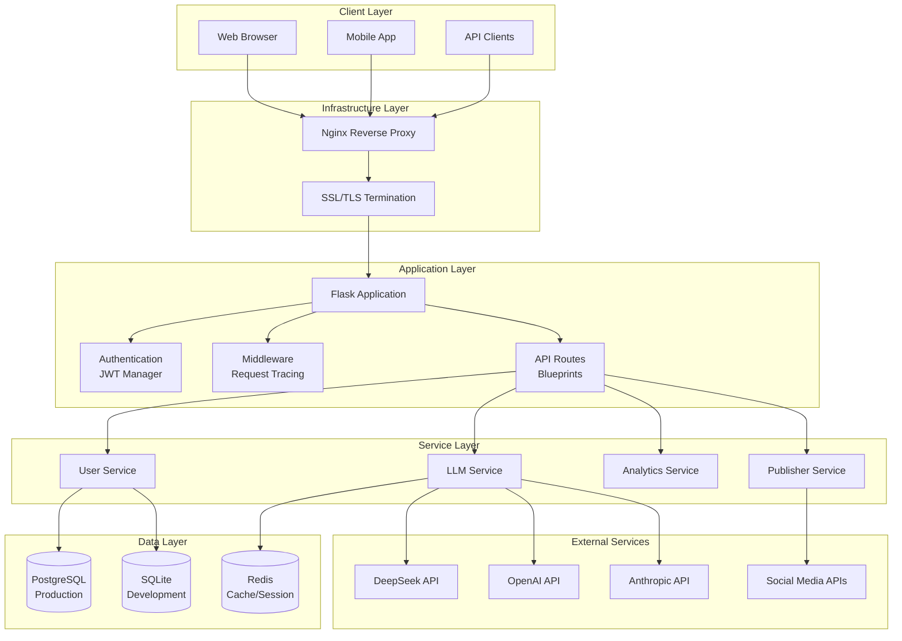
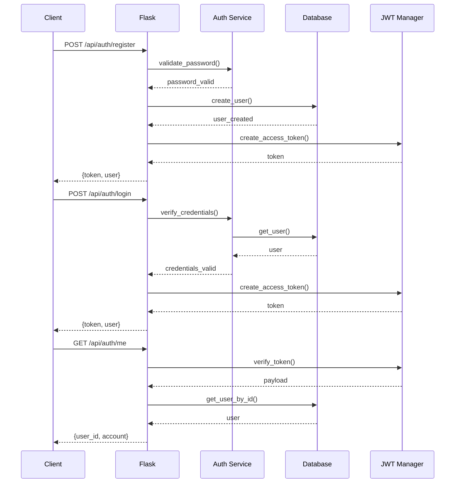
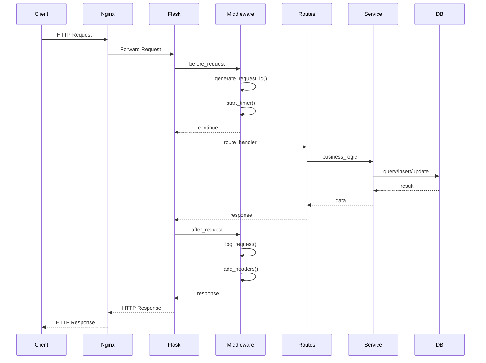
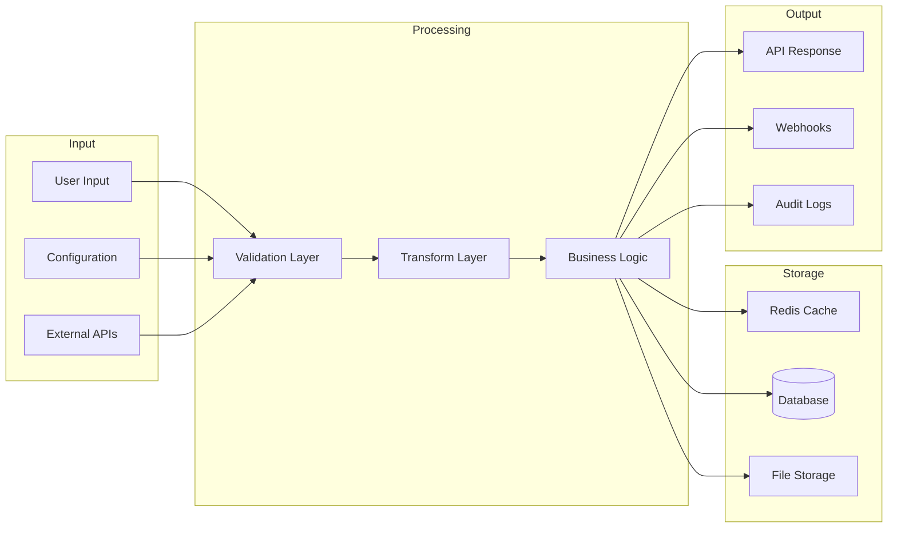
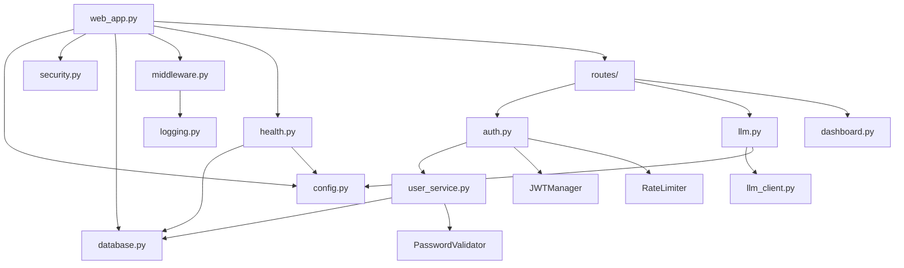
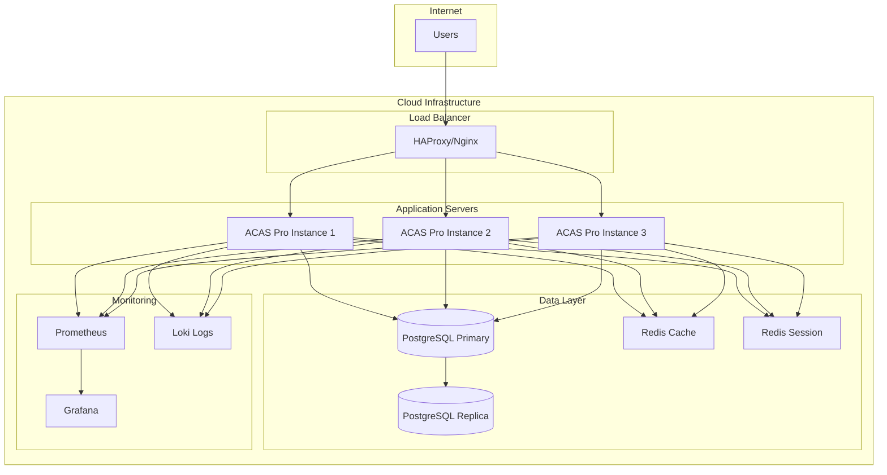
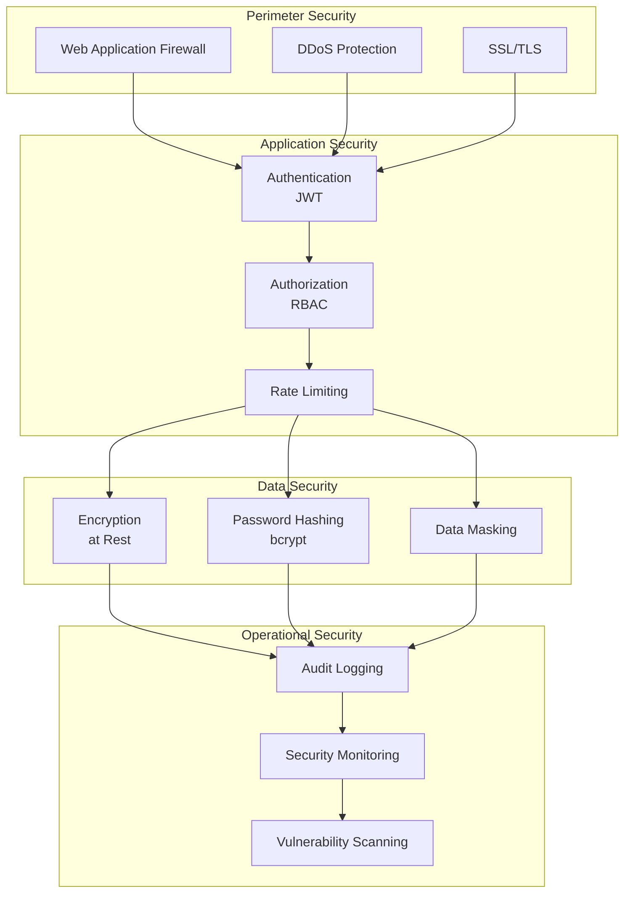

# ACAS Pro Architecture

## System Overview

## Authentication Flow

## Request Processing Flow

## Data Flow

## Module Dependencies

## Deployment Architecture

## Security Layers

## Technology Stack

| Layer | Technology |
|-------|------------|
| **Language** | Python 3.11+ |
| **Web Framework** | Flask 3.0+ |
| **Database** | PostgreSQL 16 / SQLite |
| **Cache** | Redis 7 |
| **Authentication** | JWT (PyJWT) |
| **Password Hashing** | bcrypt |
| **Encryption** | cryptography |
| **Validation** | Pydantic |
| **Testing** | pytest |
| **Documentation** | OpenAPI 3.0 |
| **Container** | Docker |
| **Orchestration** | Docker Compose |
| **CI/CD** | GitHub Actions |
| **Monitoring** | Prometheus + Grafana |

## Scalability Considerations

### Horizontal Scaling
- Stateless application servers
- Shared PostgreSQL database
- Redis for distributed caching
- Load balancer for traffic distribution

### Vertical Scaling
- Database read replicas
- Redis cluster mode
- Application server resources

### Caching Strategy
- Redis for session storage
- Application-level caching
- Database query caching

## Disaster Recovery

### Backup Strategy
- PostgreSQL: Continuous archiving + daily backups
- Redis: RDB snapshots
- Files: Incremental backups

### Recovery Time Objectives
- RTO: 1 hour
- RPO: 15 minutes

### Failover
- Database: Automatic failover to replica
- Application: Load balancer health checks
- Cache: Redis Sentinel for automatic failover
